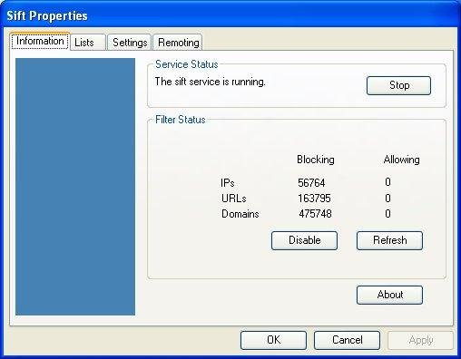
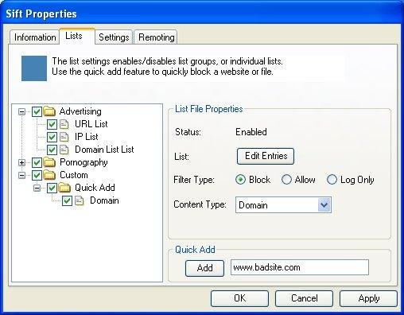
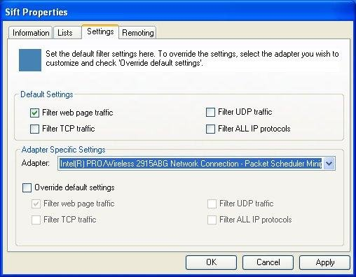
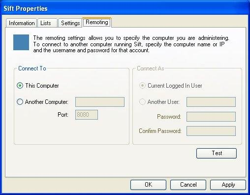
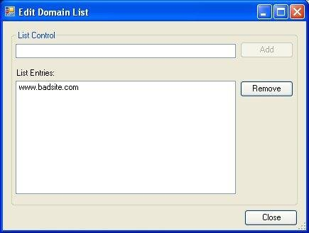
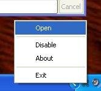

# SIFT

**Simple Internet Filtration Tool**

SIFT is a list-based website filter for Windows. It was designed to filter traffic on a stand-alone computer or traffic passing through Windows Internet Connection Sharing, using configurable allow, block, and log lists.

> [!IMPORTANT]
> This is a historical project, originally developed in 2007–2008 and published as a beta. Its kernel driver targets the Windows 2000/XP-era NDIS 5.x networking stack and is not expected to install or run on current versions of Windows. The code is preserved for reference and possible modernization; do not deploy it on a production system without a complete security review and driver rewrite.

## Screenshots

| Service and filter status                                                                        | List maintenance                                                                                |
|:------------------------------------------------------------------------------------------------:|:-----------------------------------------------------------------------------------------------:|
|      |            |
| **Adapter settings**                                                                             | **Remote administration**                                                                       |
|  |  |
| **List editor**                                                                                  | **System-tray menu**                                                                            |
|                              |                |

## Features

- Filters HTTP traffic by IP address, domain, or URL
- Supports allow, block, and log actions through configurable lists
- Applies filtering settings per network adapter
- Runs the filtering engine as a Windows service backed by an NDIS intermediate driver
- Includes a Windows Forms administration application
- Supports local and remote administration
- Tracks filtering statistics and writes diagnostic logs
- Includes list download and incremental-update support
- Provides English and Spanish UI resources

SIFT operates below the browser by capturing packets in a kernel-mode network driver, passing selected traffic to the Windows service for list matching, and returning an allow-or-drop decision to the driver.

## Repository layout

| Path                   | Purpose                                                    | Technology        |
| ---------------------- | ---------------------------------------------------------- | ----------------- |
| `application/`         | Desktop administration application                         | C#, Windows Forms |
| `service/`             | Filtering engine and Windows service                       | C#                |
| `driver/`              | NDIS intermediate network driver                           | C                 |
| `resources/`           | Shared settings, logging, list, remoting, and update types | C#                |
| `utilities/installer/` | MSI definitions and build scripts                          | WiX               |
| `test/`                | Early service test project                                 | C#                |
| `documents/uml/`       | Original class and packet-processing diagrams              | UML/PNG           |
| `website/`             | Historical list-update server scripts and assets           | PHP, shell        |

## Building the legacy code

The repository has not been updated for a modern Windows toolchain. Reproducing the original build requires an era-appropriate Windows development environment with:

- Visual Studio 2008 or Visual C# Express 2008
- .NET Framework 3.5 SDK and targeting packs
- A Windows Driver Development Kit that supports NDIS 5.1
- The WiX toolset expected by the scripts under `utilities/installer/`
- Administrator access for driver and service installation

Although the application and service projects target .NET Framework 2.0, the shared resources project targets .NET Framework 3.5, so the complete solution requires .NET Framework 3.5.

The original build order was:

1. Build `application/Sift.sln` in the desired configuration. Its solution includes the shared resources project.
2. Build `service/SiftService.sln`. It also includes the shared resources project.
3. Build `driver/` from the matching Windows DDK build environment. The `sources` file selects NDIS 5.1 for Windows XP and later, or NDIS 4 for Windows 2000.
4. Run the appropriate installer script in `utilities/installer/` after all required artifacts are present.

The installer definitions contain hard-coded `C:\sift\...` paths. They also reference a driver installer, filter-list data, and a license file that were not present in the final public SVN tree. As a result, the MSI packages are not reproducible from the archived source alone without restoring or replacing those inputs.

## Running SIFT

There is no supported installation process for current Windows releases. Historically, the MSI installer:

1. Installed and bound the `sift.sys` network driver.
2. Installed an automatically started Windows service named `Sift`.
3. Installed the SIFT administration application and initial filter lists.
4. Used the administration application to select adapters, manage lists, and enable or disable filtering.

The last published beta installer, version `0.1.0.1`, remains available from the [SourceForge file archive](https://sourceforge.net/projects/sift/files/). It should be treated as an archival artifact, not as software suitable for a current machine.

## Modernization notes

A current Windows port would require substantial work. At minimum:

- Replace the NDIS 5.x intermediate driver with a supported Windows Filtering Platform design.
- Upgrade the C# projects from .NET Framework to a supported .NET release.
- Replace .NET Remoting with an authenticated, encrypted management API.
- Replace the historical list-update endpoints and validate all downloaded data.
- Add driver signing, automated tests, CI builds, and current installer packaging.
- Review packet parsing, privilege boundaries, configuration storage, and logging for security issues.

## Project history

SIFT was registered on SourceForge in October 2007. The public source reached SVN revision 96 in February 2008, and the SourceForge project was last updated in April 2014.

- [Original SourceForge project](https://sourceforge.net/projects/sift/)
- [Archived source browser](https://sourceforge.net/p/sift/code/HEAD/tree/)
- [Historical downloads](https://sourceforge.net/projects/sift/files/)

## License

SIFT is licensed under the [GNU General Public License v3.0](LICENSE).

Copyright © 2007 Travis Jones.
